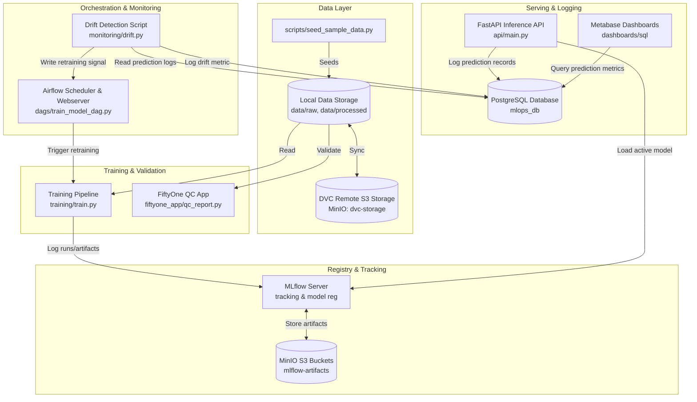

# Skin Severity MLOps (skin-severity-mlops)

An end-to-end production-grade MLOps system for estimating the severity of skin conditions from images (classification into **mild**, **moderate**, and **severe**).

> [!WARNING]
> **EDUCATIONAL AND RESEARCH PURPOSES ONLY.**
> This system is NOT a medical diagnosis tool. All prediction responses and dashboards include the disclaimer: **"AI-assisted severity estimate only. Not a medical diagnosis. For educational and research purposes only."** Do not use this tool for clinical decisions.

---

## System Architecture




---

## Services Overview

The project orchestrates 11 Docker services:
1. **api**: FastAPI inference API. Exposes `/predict`, `/health`, `/model-info`. Logs predictions to PostgreSQL database.
2. **trainer**: PyTorch Lightning training container. Trains model and registers it to MLflow tracking server.
3. **mlflow**: MLflow tracking server backed by PostgreSQL metadata database and MinIO artifact storage.
4. **postgres**: Storage for MLflow metadata, Airflow backend, prediction logs, and monitoring metrics.
5. **minio**: S3-compatible object storage hosting MLflow artifacts and DVC remote storage.
6. **airflow-webserver** & **airflow-scheduler**: Orchestrates workflows (training, evaluation, drift detection).
7. **fiftyone**: Interactive dataset inspection and quality control.
8. **fiftyone-mongo**: Database backend for FiftyOne.
9. **meltano**: ELT pipeline placeholder for ETL ingestion tasks.
10. **metabase**: Dashboard reporting tool connected to PostgreSQL.
11. **test-runner**: Container to run validation testing suite in CI.

---

## Installation & Setup

### Prerequisites
- Docker and Docker Compose installed.
- Python 3.11 installed locally (if running local development commands).
- Make utility installed.

### Step 1: Environment Variables
Create `.env` file from the example:
```bash
cp .env.example .env
```

### Step 2: Build & Start Services
Build container images and spin up the Docker network:
```bash
make build
make up
```

### Step 3: Seed Synthetic Dataset
Since no real medical data is checked into this repository, seed the folders with synthetic placeholder images:
```bash
make seed-data
```
This generates:
- `data/raw/mild/`, `data/raw/moderate/`, `data/raw/severe/`
- `data/processed/manifest.csv`
- `data/sample/test_image.jpg` (for API testing)

---

## Working with the Pipeline

### Running Tests and Linters
Run unit tests, formatters, and type-checkers locally:
```bash
make format   # Autoformat with ruff
make lint     # Lint with ruff
make test     # Run pytest suite
```
To run tests inside a Docker container:
```bash
docker compose run --rm test-runner
```

### Training the Classifier
Run a training iteration inside the trainer container:
```bash
make train
```
This runs `training/train.py`, which:
- Loads data using `training/datamodule.py`
- Preprocesses and augments images using `training/transforms.py`
- Trains a ResNet18 model utilizing PyTorch Lightning (`training/model.py`)
- Logs metrics and checkpoints to MLflow
- Registers the model in the MLflow Model Registry as `skin-severity-classifier`.

### Evaluating the Model
Evaluate the registered model or local checkpoint against test splits:
```bash
make evaluate
```

---

## Serving and Monitoring

### FastAPI Prediction Service
The API service automatically starts with `make up` on port **8000**.

#### Call `/predict` with curl:
```bash
make api-test
```
Or run curl manually:
```bash
curl -X POST http://localhost:8000/predict \
  -F "file=@data/sample/test_image.jpg" \
  -H "accept: application/json"
```

#### Example Output Response:
```json
{
  "severity": "moderate",
  "confidence": 0.87,
  "class_probabilities": {
    "mild": 0.08,
    "moderate": 0.87,
    "severe": 0.05
  },
  "model_name": "skin-severity-classifier",
  "model_version": "1",
  "prediction_id": "a1b2c3d4-e5f6-7a8b-9c0d-e1f2a3b4c5d6",
  "latency_ms": 42.15,
  "disclaimer": "AI-assisted severity estimate only. Not a medical diagnosis. For educational and research purposes only."
}
```

### Monitoring Dashboards
- **MLflow Tracking UI**: http://localhost:5000
- **Airflow Webserver**: http://localhost:8080 (credentials: `admin`/`admin`)
- **MinIO Console**: http://localhost:9001 (credentials: `minioadmin`/`minioadmin123`)
- **FiftyOne App**: http://localhost:5151
- **Metabase**: http://localhost:3000

---

## Retraining Workflow & Drift Detection

The system includes automated drift detection in `monitoring/drift.py` and scheduled triggers.

1. **Inference Logs**: FastAPI saves all prediction records to the PostgreSQL `prediction_logs` table.
2. **Drift Check**: The Airflow DAG `monitor_drift_dag` runs hourly. It pulls recent predictions (e.g., last 24h) and compares their distribution against a baseline (e.g., last 7 days) using Population Stability Index (PSI).
3. **Threshold Alert**: If PSI > 0.2:
   - A drift metric is written to PostgreSQL.
   - A retraining signal is written to `artifacts/retraining_signal.json`.
   - The Airflow DAG triggers `train_model_dag` to retrain the classifier on newly logged images.
   - Upon successful training completion, the new model is registered, and the retraining signal is cleared.

---

## Limitations & Next Steps for Real Medical Deployment

This architecture is currently optimized for local demonstration:
1. **GPU Acceleration**: For real-world scale, the training step should run on GPU-enabled instances (configured via Docker runtime or cloud training instances).
2. **Clinical Validation**: A real deployment requires clinical trials and FDA/CE-certification compliance.
3. **Privacy**: Medical images must comply with HIPAA/GDPR regulations. High-standard data masking, consent forms, and secure access trails must be built around ingestion pipelines.
4. **Data Sourcing**: Replace `seed_sample_data.py` with real skin lesion databases such as the ISIC (International Skin Imaging Collaboration) Archive.
